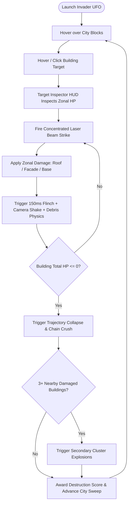
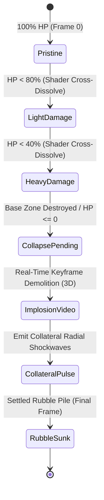

# Game Design Document (GDD): ALINV-3D

## 1. Executive Summary & Game Concept

**ALINV-3D** is an arcade-action 2.5D isometric destruction simulator where the player controls an extraterrestrial **UFO Mothership** invading a dense, procedurally generated human metropolis (modeled after New York City). 

The game combines high-octane destruction fantasy with tactical targeting, multi-stage zonal building demolition, and real-time physics debris juice.

### High Concept Statement
> *"Command an alien invader vessel, sweep across city blocks, target critical building zones with high-energy plasma lasers, and trigger chain-reaction urban collapses in a responsive 2.5D isometric sandbox."*

---

## 2. Core Gameplay Loop

---

## 3. Player Controls & UFO Mothership

### UFO Flight & Movement
- **Positioning**: The player UFO hovers at a high flight altitude ($Z = 75$ world units) above city skyscrapers.
- **Flight Mechanics**: Handled by [`PlayerControlSystem.ts`](file:///home/berkans/development/alienv2/src/systems/PlayerControlSystem.ts), following mouse pointer position smoothly across the isometric ground plane using frame-rate independent exponential damping ($\lambda = 14$).
- **WASD / Arrow Key Directional Navigation**: In addition to mouse following, keyboard inputs (`WASD` or Arrow keys) apply screen-aligned directional translation vectors (Up: $-X, -Z$; Down: $+X, +Z$; Left: $-X, +Z$; Right: $+X, -Z$) at $65\text{ units/s}$ with hard map boundary clamping ($-480$ to $+480$).
- **Dynamic Surface Targeting Ring**: Projects a glowing cyan alien targeting ring beneath the mothership that dynamically lerps between street level ($Y=0.1$) and building roof height ($Y_{roof}$) when hovering over structures, rendered above buildings (`renderOrder = 800`).

### Laser Weapon System & Precision Aim Disambiguation
- **Primary Weapon**: High-energy pulsed laser beam.
- **Targeting & Precision Disambiguation**: Clicking or holding mouse button casts a 3D ray through the isometric view camera ([`Raycaster.ts`](file:///home/berkans/development/alienv2/src/input/Raycaster.ts)) into candidate building hit zones. When multiple buildings overlap along the sightline, the engine applies **Small-Building Priority Weighting** (`SMALL_BUILDING_PRIORITY_WEIGHT = 0.36` vs. `MEGA_LANDMARK_PENALTY_WEIGHT = 1.30`) with screen-space candidate proximity, allowing players to target low-rise shops and brownstones directly adjacent to massive towers without the large tower's hitbox swallowing the click.
- **Fire Rate**: Governed by `WeaponComponent` fire rate timers (e.g., $0.2\text{s}$ per burst).
- **Beam FX**: Instantiates dynamic neon laser beam line meshes (`renderOrder = 2000`) from UFO underbelly ($Z=75$) directly down to impact target coordinates, powered by an 8-beam pre-allocated geometry pool.

---

## 4. Multi-Stage Zonal Destruction & Demolition Mechanics

Unlike primitive destruction games where buildings disappear or swap to a flat ruin texture, ALINV-3D implements **Zonal Building Structural Failure**:

| Zone ID | Physical Region | Tactical Significance |
| :--- | :--- | :--- |
| `roof` | Upper 30% of structure | Easiest to hit from high altitude; triggers heavy dust/sparks |
| `facade` | Middle 40% of structure | Main visual body; damages facade panels |
| `base` | Bottom 30% ground contact | Critical structural support; destroying base accelerates total collapse |

### Advanced Destruction Features
- **GLSL Shader Cross-Dissolve Blending**: 2D building sprites cross-dissolve seamlessly between damage stages over $0.3\text{s}$ using custom GLSL shader blending (`mixRatio` $0.0 \to 1.0$), eliminating visual state pops.
- **Upright 3D Keyframe Demolition**: 3D Skyscraper mega-towers remain strictly upright along their vertical axis, playing 590 GLTF animation tracks to crumble vertically into a settled rubble pile without sideways tipping.
- **Demolition Audio Synchronization**: Demolition audio cues are triggered synchronously with visual collapse events when drained from `FXRenderer`, completely eliminating audio desync between visual debris collapse and audio playback.
- **Multi-Height Shaft Blasts**: During 3D tower implosion, multi-stage blast explosions detonate at random height elevations along the skyscraper shaft, accompanied by camera screen rumbles.
- **Radial Collateral Damage**: Demolishing a mega-structure emits distance-attenuated shockwaves (`applyCollateralDamage`) that damage and scorch surrounding building facade/roof/base zones within a 64-unit radius.
- **Hybrid City Composition**: The metropolis features 4 unique 3D landmark towers anchored in downtown civic plazas (`mega_titan`, `spaceship_hq`, `financial_tower`, `cyber_reactor`) accompanied by 880+ dense 2D billboard buildings spanning 23 architectural varieties.

---

## 5. UI Overlay & Target Inspector

The HUD ([`UIOverlay.ts`](file:///home/berkans/development/alienv2/src/rendering/UIOverlay.ts)) provides tactical readouts in cyan neon styling:

1. **Target Inspector Box**: Displays building name, tier classification, total HP bar, and individual zone damage status (`ROOF`, `FACADE`, `BASE`).
2. **Vignette Impact Flash**: Fullscreen white flash overlay triggered on heavy weapon impacts and cluster blasts.
3. **Screen Shake Dynamics**: Camera shake intensity decays via smooth exponential envelopes rather than linear timers.

---
*Back to [Documentation Sitemap](file:///home/berkans/development/alienv2/docs/README.md)*
