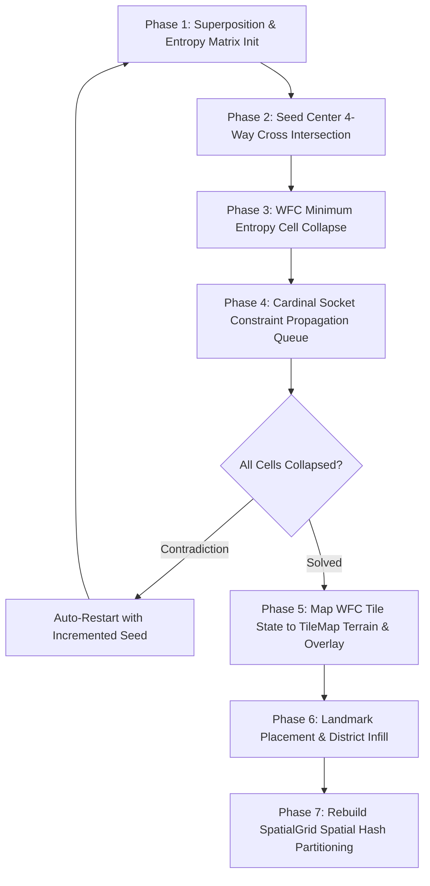

# Procedural City World Generation & Tile Systems


## 1. World Generation Architecture & Wave Function Collapse (WFC)

The city map in ALINV-3D is generated procedurally via [`CityGenerator.ts`](file:///home/berkans/development/alienv2/src/systems/CityGenerator.ts) and [`WFCSolver.ts`](file:///home/berkans/development/alienv2/src/generation/WFCSolver.ts) operating on a 64×64 cell grid (`TileMap.GRID_DIM = 64`, `TILE_SIZE = 16`, Total World Bounds = 1024×1024 units).



### Wave Function Collapse (WFC) Socket Rules
- **Tile Prototypes ([`WFCTilePrototypes.ts`](file:///home/berkans/development/alienv2/src/generation/WFCTilePrototypes.ts))**: Defines 20+ directional tile prototypes for straight roads (NS/EW), corners (NE/NW/SE/SW), T-intersections, 4-way cross intersections, commercial skyscraper lots, residential blocks, civic parks, and waterfront canals.
- **Socket Matching (`SocketType`)**: Cardinal sockets (`N`, `E`, `S`, `W`) enforce socket compatibility (`ROAD`, `SIDEWALK`, `PLAZA`, `WATER`, `BUILDING_LOT`), guaranteeing 100% connected road networks with zero disconnected road stubs.
- **Shannon Entropy Collapse**: Selects the uncollapsed cell with lowest Shannon entropy $H(c) = \log_2(\sum w) - \frac{\sum w \log_2(w)}{\sum w} + \epsilon$ and collapses its superposition via weighted random selection.

---

## 2. District Zoning & Central Focal Point Layout

The city is partitioned into 5 thematic urban districts defined in [`MapDefinition.ts`](file:///home/berkans/development/alienv2/src/core/MapDefinition.ts) around the **Central 3D Skyscraper Focal Point**:

| District Zone | Grid Region | Landmark / Centerpiece | Building Types |
| :--- | :--- | :--- | :--- |
| **Central Downtown Core** | Map Center ($gx=28, gz=28$) | **3D Skyscraper (`'5'`)**, Art Deco Titan | Cyber Spires, Glass Commercial Towers |
| **North-West Airfield** | North-West ($gx=0..15, gz=0..15$) | Spaceship HQ Control Tower (`spaceship_hq`) | Tarmac Runway, Flight Apron, Hangers |
| **North-East Sports & Parks** | North-East ($gx=37..63, gz=0..25$) | **Twin Stadium Arenas (`mega_stadium`)** | Sports Arenas, Green Park Belts, Trees |
| **South-East Harbor & Docks** | South-East ($gx=37..63, gz=37..63$) | **Statue of Liberty Island**, Canal | Water Canal, Docks, Warehouses (`4`) |
| **South-West Residential** | South-West ($gx=0..25, gz=37..63$) | **Hospital (`1`)**, **Shopping Mall (`2`)** | Brownstones (`b1`, `b2`), Civic Buildings |

```typescript
const ZONE_DENSITY: Partial<Record<ZoneId, number>> = {
  financial:   0.55,
  tech:        0.50,
  civic:       0.58,
  residential: 0.42,
  docks:       0.35,
};
```

---

## 3. Water Platform & Island Landmarks

Island platforms (such as the **Statue of Liberty**) use a custom multi-pass placement routine:

1. **Water Isolation**: Water tiles mark candidate cells as `occupied = true` to prevent standard urban infill.
2. **Platform Painting**: A `PLAZA_STONE` platform is painted over the water.
3. **Platform Cell Clearing**: Platform cells are explicitly cleared in the occupancy matrix.
4. **Centroid Alignment**: Landmark buildings are placed exactly at the centroid of the platform.

---

## 4. Multi-Layer Tile Map Architecture

Ground rendering ([`GroundRenderer.ts`](file:///home/berkans/development/alienv2/src/rendering/GroundRenderer.ts)) uses a 3-layer architecture:

```
┌────────────────────────────────────────────────────────┐
│ Layer 3: Dynamic Decals & Scorch Marks (DecalManager)   │
├────────────────────────────────────────────────────────┤
│ Layer 2: Overlay Road Markings & Sidewalks (TileMap)   │
├────────────────────────────────────────────────────────┤
│ Layer 1: Base Terrain Mesh (Grass, Asphalt, Water)     │
└────────────────────────────────────────────────────────┘
```

### Road Network & Waypoint Navigation
- Roads are laid out along North-South avenues and East-West streets.
- Road intersections automatically set `TerrainType.ROAD_INTERSECTION` to display crosswalk markings.
- Named `RoadWaypoint` nodes are generated along road channels for vehicle traffic pathfinding systems.

---
*Back to [Documentation Sitemap](file:///home/berkans/development/alienv2/docs/README.md)*
