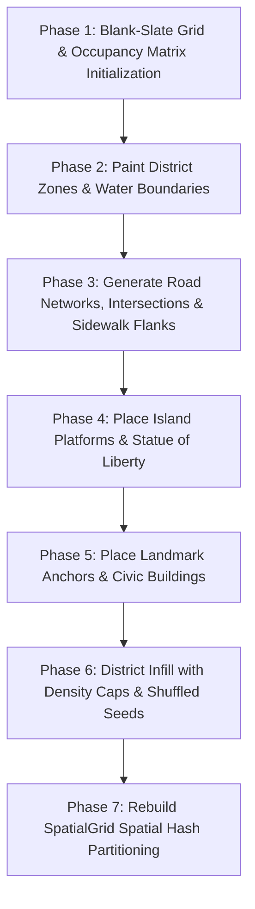

# Procedural City World Generation & Tile Systems


## 1. World Generation Architecture

The city map in ALINV-3D is generated procedurally via [`CityGenerator.ts`](file:///home/berkans/development/alienv2/src/systems/CityGenerator.ts) operating on a 64×64 cell grid (`TileMap.GRID_DIM = 64`, `TILE_SIZE = 16`, Total World Bounds = 1024×1024 units).



---

## 2. District Zoning & Density Management

The city is partitioned into 5 distinct urban districts defined in [`MapDefinition.ts`](file:///home/berkans/development/alienv2/src/core/MapDefinition.ts):

| District Zone | Grid Region | Terrain Type | Density Cap | Building Types |
| :--- | :--- | :--- | :--- | :--- |
| **Financial District** | North-East | Dark Asphalt / Concrete | 55% | Cyber Spires, Art Deco Titans, Skyscrapers |
| **Tech Corridor** | Central-North | High-Tech Slate | 50% | Biotech Helix, Glass Mid-rises |
| **Civic Center** | Center | Plaza Stone / Parks | 58% | Sky Gardens, Bronze Penthouses |
| **Residential Borough**| South | Brownstone / Brick | 42% | Low-rise Shops, Brownstones |
| **Docks & Waterfront** | South-East | Water & Docks | 35% | Warehouses, Shipping Terminals |

```typescript
const ZONE_DENSITY: Partial<Record<ZoneId, number>> = {
  financial:   0.55,
  tech:        0.50,
  civic:       0.58,
  residential: 0.42,
  docks:       0.35,
};
```

---

## 3. Water Platform & Island Landmarks

Island platforms (such as the **Statue of Liberty**) use a custom multi-pass placement routine:

1. **Water Isolation**: Water tiles mark candidate cells as `occupied = true` to prevent standard urban infill.
2. **Platform Painting**: A `PLAZA_STONE` platform is painted over the water.
3. **Platform Cell Clearing**: Platform cells are explicitly cleared in the occupancy matrix.
4. **Centroid Alignment**: Landmark buildings are placed exactly at the centroid of the platform.

---

## 4. Multi-Layer Tile Map Architecture

Ground rendering ([`GroundRenderer.ts`](file:///home/berkans/development/alienv2/src/rendering/GroundRenderer.ts)) uses a 3-layer architecture:

```
┌────────────────────────────────────────────────────────┐
│ Layer 3: Dynamic Decals & Scorch Marks (DecalManager)   │
├────────────────────────────────────────────────────────┤
│ Layer 2: Overlay Road Markings & Sidewalks (TileMap)   │
├────────────────────────────────────────────────────────┤
│ Layer 1: Base Terrain Mesh (Grass, Asphalt, Water)     │
└────────────────────────────────────────────────────────┘
```

### Road Network & Waypoint Navigation
- Roads are laid out along North-South avenues and East-West streets.
- Road intersections automatically set `TerrainType.ROAD_INTERSECTION` to display crosswalk markings.
- Named `RoadWaypoint` nodes are generated along road channels for vehicle traffic pathfinding systems.

---
*Back to [Documentation Sitemap](file:///home/berkans/development/alienv2/docs/README.md)*
