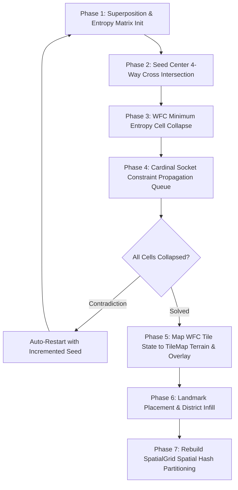

# Procedural City World Generation & Tile Systems


## 1. World Generation Architecture & Wave Function Collapse (WFC)

The city map in ALINV-3D is generated procedurally via [`CityGenerator.ts`](file:///home/berkans/development/alienv2/src/systems/CityGenerator.ts) and [`WFCSolver.ts`](file:///home/berkans/development/alienv2/src/generation/WFCSolver.ts) operating on a 64×64 cell grid (`TileMap.GRID_DIM = 64`, `TILE_SIZE = 16`, Total World Bounds = 1024×1024 units).



### Wave Function Collapse (WFC) Socket Rules
- **Tile Prototypes ([`WFCTilePrototypes.ts`](file:///home/berkans/development/alienv2/src/generation/WFCTilePrototypes.ts))**: Defines 20+ directional tile prototypes for straight roads (NS/EW), corners (NE/NW/SE/SW), T-intersections, 4-way cross intersections, commercial skyscraper lots, residential blocks, civic parks, and waterfront canals.
- **Socket Matching (`SocketType`)**: Cardinal sockets (`N`, `E`, `S`, `W`) enforce socket compatibility (`ROAD`, `SIDEWALK`, `PLAZA`, `WATER`, `BUILDING_LOT`), guaranteeing 100% connected road networks with zero disconnected road stubs.
- **Shannon Entropy Collapse**: Selects the uncollapsed cell with lowest Shannon entropy $H(c) = \log_2(\sum w) - \frac{\sum w \log_2(w)}{\sum w} + \epsilon$ and collapses its superposition via weighted random selection.

---

## 2. District Zoning & Chunk-Based High-Density Packing

The city map is generated via a 16-chunk grid ($4 \times 4$ macro-districts of $16 \times 16$ tiles each) defined in [`bake_assets.py`](file:///home/berkans/development/alienv2/scripts/bake_assets.py):

| District Archetype | Chunk Coordinates | Character & Layout | Building Catalog Pools |
| :--- | :--- | :--- | :--- |
| **Downtown Core & Skyline** | Chunks `(1,1), (2,1), (1,2), (2,2)` | 4 Unique 3D Mega-Landmarks with grand stone plazas (`PLAZA_STONE`), surrounded by 2D skyscrapers on $2\times 2$ lots | `mega_titan`, `spaceship_hq`, `financial_tower`, `cyber_reactor`, `5`, `sky_artdeco`, `sky_cyber`, `sky_biotech`, `res_sky` |
| **High-Density Commercial Market** | Chunks `(0,1), (0,2), (3,1), (3,2)` | Bustling urban market strips with 1x1 shops packed side-by-side (step 1) along sidewalks and mid-block pedestrian breezeways | `b1` (Shop), `b2` (Brownstone), `res_bronze`, with occasional mid-rises (`b3`, `b4`, `mall_shopping`) |
| **High-Density Residential Corridors** | Chunks `(1,0), (2,0), (1,3), (2,3)` | Dense townhouse blocks, brownstone rows, and mid-rise apartments | `b2`, `res_bronze`, `b3` (Apartments), `b4` (Office), `res_sky` |
| **Civic & Suburban Perimeter** | Chunks `(0,0), (3,0), (0,3), (3,3)` | Major civic landmark institutions, green parklet pockets, and low-rise neighborhoods | `pentagon_defense`, `mega_stadium`, `statue_liberty`, `hospital_civic`, `school_civic`, `1`, `2`, `3`, `4` |

### 3D Landmark Allocation & North Clearance Buffers
To ensure rock-solid 60 FPS performance without CPU animation mixer bottlenecks:
- **Exactly 1 Instance per 3D Model**: The 4 GLTF 3D models are each placed **exactly once** in designated downtown lots:
  - `mega_titan` $\rightarrow$ `skyscraper_demolition.glb` (Apex Mega-Tower, height $\sim 157$ units)
  - `spaceship_hq` $\rightarrow$ `spaceship_hq.glb` (Alien Spaceship HQ)
  - `financial_tower` $\rightarrow$ `financial_tower.glb` (Metro Financial Tower)
  - `cyber_reactor` $\rightarrow$ `cyber_reactor.glb` (Cyber Quantum Reactor)
- **North Corridor Clearance**: Behind each 3D landmark, a 6-tile corridor to the North ($-Z$) and 4-tile corridor to the North-West ($-X$) is reserved as open `PLAZA_STONE` paving with `occupied = true`, keeping the dramatic skyline view open and clear.
- **High-Density 2D Infill**: The remaining city infill uses 880+ lightweight 2D billboard sprites across 23 building types, resulting in an alive, packed metropolis with **0 footprint overlaps**.

---

## 3. Water Platform & Island Landmarks

Island platforms (such as the **Statue of Liberty**) use a custom multi-pass placement routine:

1. **Water Isolation**: Water tiles mark candidate cells as `occupied = true` to prevent standard urban infill.
2. **Platform Painting**: A `PLAZA_STONE` platform is painted over the water.
3. **Platform Cell Clearing**: Platform cells are explicitly cleared in the occupancy matrix.
4. **Centroid Alignment**: Landmark buildings are placed exactly at the centroid of the platform.

---

## 4. Multi-Layer Tile Map Architecture

Ground rendering ([`GroundRenderer.ts`](file:///home/berkans/development/alienv2/src/rendering/GroundRenderer.ts)) uses a 3-layer architecture:

```
┌────────────────────────────────────────────────────────┐
│ Layer 3: Dynamic Decals & Scorch Marks (DecalManager)   │
├────────────────────────────────────────────────────────┤
│ Layer 2: Overlay Road Markings & Sidewalks (TileMap)   │
├────────────────────────────────────────────────────────┤
│ Layer 1: Base Terrain Mesh (Grass, Asphalt, Water)     │
└────────────────────────────────────────────────────────┘
```

### Road Network & Waypoint Navigation
- Roads are laid out along North-South avenues and East-West streets.
- Road intersections automatically set `TerrainType.ROAD_INTERSECTION` to display crosswalk markings.
- Named `RoadWaypoint` nodes are generated along road channels for vehicle traffic pathfinding systems.

---

## 5. Procedural Ground Texture Color Palette

All ground textures are generated at runtime via HTML5 Canvas 2D in [`TileRenderer.ts`](file:///home/berkans/development/alienv2/src/rendering/TileSystem/TileRenderer.ts). Each type is visually distinct to avoid the monochromatic dark-grey prototype look:

| Terrain Type | Base Color | Visual Character |
| :--- | :--- | :--- |
| **`ROAD_STRAIGHT_NS/EW`** | `#1c1f24` dark asphalt | White curb lines, double yellow centre, dashed lane dividers |
| **`ROAD_INTERSECTION`** | `#1c1f24` dark asphalt | 4-way zebra crosswalks, corner curb caps |
| **`SIDEWALK`** | `#5a6473` light blue-grey | Paving joint grid, fine concrete grain (range 80–110) |
| **`PLAZA_STONE`** | `#9e8e78` warm sandstone | Staggered stone tile grout (`#6e6050`), warm speckle noise |
| **`GRASS`** | `#2d6a2d` vivid green | 8000-dot noise (green channel 90–145), blade streak shadows |
| **`WATER`** | `#0d3d7a` deep navy | `#1565c0` shimmer patches, `#55ccff` wave highlights, foam tips |

> **Design invariant:** Road asphalt (`#1c1f24`) and grass (`#2d6a2d`) must remain visually distinct at all zoom levels. The green channel gap (≥ 42 units between `#1c` and `#2d`) provides sufficient contrast even under directional light shadow.

---

## 6. Curated Procedural Generation — Deterministic 6-Pass Pre-Baking Pipeline

ALINV-3D uses a **two-phase generation architecture** that decouples rich city synthesis from runtime loading performance:

```
OFFLINE PHASE (generator.html / MapBaker.ts):
  Pass 1: Macro Geography (South-East ocean water spline & land grass default)
  Pass 2: Water Platforms & Statue of Liberty Island Anchor
  Pass 3: Hierarchical Road Network (2-Lane Arterials, Diagonal Boulevard, 6x6 Downtown Grid, Harbor Piers)
  Pass 4: Landmark Anchors & Dedicated Buffer Rings (Apple Ring, Apex Tower, Arenas)
  Pass 5: District Morphology & Perimeter Lot Infill (Wall-to-wall Downtown towers, Suburban lawns)
  Pass 6: 4,096-Tile Serialization & JSON Export
  → Output: static/generated_map.json (~150 KB)

RUNTIME PHASE (main.ts / MapLoader.ts):
  - Fetches static/generated_map.json (< 10ms)
  - Validates schema version ("1.0.0")
  - Hydrates all 4,096 TileMap grid cells & road waypoints directly
  - Spawns building ECS entities from serialized lot records
  - Rebuilds SpatialGrid
  - Fallback: Triggers MapBaker.bake() dynamically if JSON is absent or missing tiles
```

### Map Data Schema (`GeneratedMapSchema.ts`)
The serialized JSON structure contains:
- `version`: Schema version tag (`"1.0.0"`).
- `seed`: Numeric seed used for generation (`42`).
- `gridDim`: Grid size (`64`).
- `tiles`: All 4,096 terrain tiles ($64 \times 64$ array of `{ terrainType, overlayType, isIntersection?, roadAxis? }` or flat array).
- `buildings`: Array of `{ gx, gz, w, h, typeKey, lotType, centerWorldX, centerWorldZ }`.
- `roadWaypoints`: Array of `{ worldX, worldZ, name }`.
- `metadata`: Generation metrics (`generatedAt`, `layerTimings`, `wfcAttempts`, `buildingCount`).

---
*Back to [Documentation Sitemap](file:///home/berkans/development/alienv2/docs/README.md)*
