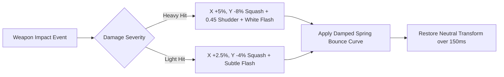

# Destruction Physics, Particles, & Visual Juice Pipeline


## 1. Visual Juice & 150ms Flinch Pipeline

ALINV-3D implements a 150ms visual response pipeline in [`BuildingRenderer.ts`](file:///home/berkans/development/alienv2/src/rendering/BuildingRenderer.ts) whenever a building receives weapon impacts:



### Micro-Flinch Squash & Damped Spring-Bounce Equation
Scale multipliers decay smoothly via a damped harmonic oscillator curve:

$$S(t) = 1 + (S_{\text{peak}} - 1) \cdot \sin(\pi t) \cdot e^{-6t} \cdot \cos(2\pi \cdot 3 \cdot t) \quad (t \in [0, 1] \text{ over } 0.15\text{s})$$

- **Heavy Impact**: $S_x = 1.05$, $S_y = 0.92$, Shudder Amplitude $= 0.45$.
- **Light Impact**: $S_x = 1.025$, $S_y = 0.96$.

---

## 2. GLSL Cross-Dissolve Texture Blending Protocol

To eliminate harsh frame pops when 2D buildings change damage states:

1. **State Mutation**: [`DestructionSystem.applyZonalDamage`](file:///home/berkans/development/alienv2/src/systems/DestructionSystem.ts#L145) calculates the new damage stage frame index.
2. **GLSL Shader Morphing**: Instead of instantly snapping texture references, [`BuildingRenderer.ts`](file:///home/berkans/development/alienv2/src/rendering/BuildingRenderer.ts#L400-L435) assigns `mapA` (current frame) and `mapB` (target frame).
3. **Smooth Mix Ratio**: `mixRatio` smoothly animates from $0.0 \to 1.0$ over $0.3\text{s}$ ($1 / 3.33\text{s}$), cross-dissolving the old texture into the new damaged sprite texture right before your eyes with zero visual popping.

---

## 3. Radial Collateral Damage & Demolition Blast Engine

When a major 3D mega-tower or heavy structure collapses, [`DestructionSystem.applyCollateralDamage`](file:///home/berkans/development/alienv2/src/systems/DestructionSystem.ts#L81) triggers shockwave damage to nearby structures:

1. **Radial Query**: Uses `SpatialGrid.queryRadius(originX, originZ, radius)` (radius $= 64$ world units) to find neighboring buildings.
2. **Quadratic Distance Falloff**: Damage decreases as distance from blast centroid increases:
   $$\text{damage} = \text{maxDamage} \times \left(1 - \frac{\text{dist}}{\text{radius}}\right)$$
3. **Zonal Impact & Scorch Marks**: Inflicts damage on random structural zones (`CENTER`, `TOP_CENTER`, `BASE_CENTER`, `BASE_LEFT`, `BASE_RIGHT`), updates global building health states, and spawns hit sparks, smoke plumes, and scorch decals.
4. **Multi-Height Demolition Shaft Explosions**: During 3D tower implosion ($t = 1.0\text{s}, 2.5\text{s}, 4.0\text{s}$), multi-stage explosions detonate at random height elevations along the skyscraper shaft, accompanied by camera screen rumbles.

---

## 3. O(1) Free-List Particle Pool Architecture

Particle simulation ([`ParticleRenderer.ts`](file:///home/berkans/development/alienv2/src/rendering/ParticleRenderer.ts)) manages thousands of debris particles (rubble, dust, smoke, sparks) with **zero runtime memory allocation**:

```
                       Particle Pool (Pre-allocated Array)
     ┌──────────┬──────────┬──────────┬──────────┬──────────┬──────────┐
Index│    0     │    1     │    2     │    3     │   ...    │   1999   │
     ├──────────┼──────────┼──────────┼──────────┼──────────┼──────────┤
State│ Active   │ Inactive │ Active   │ Inactive │ Inactive │ Active   │
     └──────────┴────┬─────┴──────────┴────┬─────┴────┬─────┴──────────┘
                     │                     │          │
                     └─────────────────────┴──────────┘
                                           │
                           Free-List Index Stack: [1, 3, 4...]
```

- **Spawn**: Spawning pops an index from the free-list in $O(1)$ time.
- **Recycle**: Expired particles push their index back onto the free-list in $O(1)$ time.
- **Memory Footprint**: 0 bytes allocated per frame.

---

## 4. Bouncy Debris Physics Simulation

Debris particles exhibit realistic gravity and ground-bounce dynamics:

$$\mathbf{v}_{t+\Delta t} = \mathbf{v}_t + \mathbf{g} \cdot \Delta t \quad (\mathbf{g} = [0, -98.0, 0]^\text{T})$$

$$\mathbf{p}_{t+\Delta t} = \mathbf{p}_t + \mathbf{v}_{t+\Delta t} \cdot \Delta t$$

- **Ground Bounce Condition**: When $P_y \le 0$:
  - $V_y \leftarrow -V_y \times 0.45$ (Restitution coefficient).
  - $V_x \leftarrow V_x \times 0.7$, $V_z \leftarrow V_z \times 0.7$ (Friction damping).
- **Building Palette Matching**: Debris particles inherit building-specific color palettes (e.g., Hospital white/red cross, School brick-tan, Commercial concrete-grey).

---

## 5. Cluster Explosion Detection System

When multiple nearby buildings sustain severe structural damage, [`DestructionSystem.checkClusterExplosions`](file:///home/berkans/development/alienv2/src/systems/DestructionSystem.ts#L78) triggers chain-reaction cluster blasts:

1. **Scan Condition**: Every $3.0\text{s}$, scans for buildings with damage ratio $\ge 35\%$.
2. **Adjacency Check**: Groups buildings within radius $R = 80$ world units.
3. **Trigger**: If cluster size $\ge 3$, fires overlapping blasts across the cluster centroid, accompanied by high-intensity screen shake ($\text{intensity} = 14$) and procedural sub-bass audio booms.

---
*Back to [Documentation Sitemap](file:///home/berkans/development/alienv2/docs/README.md)*
