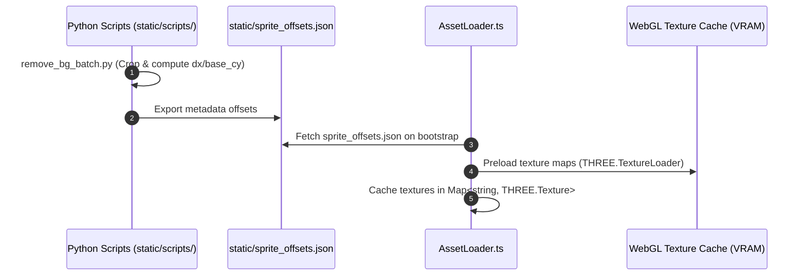

# Asset Pipeline, Spritesheet Metadata, & VRAM Lifecycle

## 1. Asset Pipeline Overview

The asset pipeline in ALINV-3D manages texture loading, sprite sheet frame extraction, bounding box offset calculation, and GPU VRAM lifecycle management.



---

## 2. Spritesheet Metadata Contract (`sprite_offsets.json`)

Billboard alignment relies on [`static/sprite_offsets.json`](file:///home/berkans/development/alienv2/static/sprite_offsets.json). Every building damage frame defines an offset object:

```json
{
  "building_1_stage_0": {
    "w": 160,
    "h": 220,
    "dx": -80,
    "dy": -220,
    "base_cy": 218,
    "x_min": 12,
    "x_max": 148,
    "y_min": 5,
    "y_max": 218
  }
}
```

### Metadata Contracts Definitions
- `w`, `h`: Tight cropped pixel dimensions of the non-transparent building sprite.
- `dx`: Horizontal pixel offset from local origin to left edge (typically $-w / 2$).
- `dy`: Vertical pixel offset from local origin to top edge.
- `base_cy`: Vertical pixel coordinate of the ground-contact line (bottom baseline).
- `x_min`, `x_max`, `y_min`, `y_max`: Tight non-transparent pixel boundary box.

> **Runtime Metadata Validation (Roof-Sample Rejection):** Automated offset extractors can inadvertently sample roof features or central atriums rather than the true ground diamond (e.g., Shopping Mall `base_cy = 369` on a `768` height sprite). The engine verifies:
> `base_cy >= h * 0.55 && (yMax - base_cy) <= h * 0.45`
> If metadata fails this test, ground contact is safely derived from $y_{\text{max}} - \text{halfDiamond}$, preventing wide buildings from sinking into ground tiles.

---

## 3. 3D GLTF Landmark Asset Pipeline

In addition to 2D billboard sprites, the asset pipeline manages 4 high-fidelity animated 3D GLTF models:

| Model Key | GLTF Asset File | Visual Class & Role | Animations & Tracks |
| :--- | :--- | :--- | :--- |
| `mega_titan` | `skyscraper_demolition.glb` | Apex Skyscraper Mega-Tower (height $\sim 157$) | 590 fracture demolition keyframe tracks |
| `spaceship_hq` | `spaceship_hq.glb` | Extraterrestrial Downtown Embassy | Dynamic hovering lighting & hull rotation |
| `financial_tower` | `financial_tower.glb` | Metro Stock Exchange Citadel | Multi-tier stepped glass facade |
| `cyber_reactor` | `cyber_reactor.glb` | Quantum Power Substation | Emissive core energy pulses |

### Asset Ingestion & Mixer Lifecycle
1. **GLTF Preloading**: GLTF models are loaded via Three.js `GLTFLoader` during bootstrap and stored in `AssetLoader`.
2. **Animation Mixer Budget**: To maintain 60 FPS without overloading the CPU with 70,000+ keyframe track evaluations per frame, 3D models are capped at **exactly 1 instance per model** (4 total mixers).
3. **Upright Demolition Alignment**: 3D towers are anchored at ground level ($Y = 0$) and execute strictly vertical implosion animations without tipping into adjacent streets.

---

## 4. Building Catalog Coverage (23 Architectural Types)

The 2D infill uses 23 distinct architectural types across 4 urban tiers:
- **Landmarks & Civics**: `pentagon_defense`, `mega_stadium`, `statue_liberty`, `hospital_civic`, `school_civic`.
- **Commercial & Downtown**: `mall_shopping`, `sky_artdeco`, `sky_cyber`, `sky_biotech`, `5`, `res_sky`.
- **Mid-Rise & Offices**: `b3`, `b4`, `res_bronze`, `1`, `2`, `3`, `4`.
- **High-Density Low-Rise Retail & Brownstones**: `b1` (Shop), `b2` (Brownstone row).

---

## 5. Python Asset Processing Tools (`static/scripts/`)

The `static/scripts/` directory contains automated Python utility scripts for asset generation:

### 1. Centroid-Based Spritesheet Slicing (`partition_fire_perfect.py`)
Slices linear explosion and fire spritesheets into uniform frame grids while calculating visual center-of-mass centroids via `scipy.ndimage.center_of_mass`.

### 2. Batch Background Removal & Offsets Generator (`remove_bg_batch.py`)
Processes raw 2D artwork:
1. Strips background keying colors.
2. Crops image to tight non-transparent bounds.
3. Computes `base_cy` ground contact coordinates.
4. Generates updated JSON entries directly into `sprite_offsets.json`.

---

## 6. WebGL VRAM & Memory Leak Prevention

To prevent GPU VRAM inflation and memory leaks across long browser sessions:

1. **Bootstrap Preloading**: Textures are loaded **once** during startup ([`AssetLoader.loadAll()`](file:///home/berkans/development/alienv2/src/assets/AssetLoader.ts)) and stored in a central lookup `Map<string, THREE.Texture>`.
2. **Texture Reuse**: Entities sharing building types reuse existing `THREE.Texture` references without duplicating GPU texture buffers.
3. **Ground Mesh & Texture Disposal Protocol**: When the city map regenerates or reloads, [`TileRenderer.dispose()`](file:///home/berkans/development/alienv2/src/rendering/TileSystem/TileRenderer.ts#L155-L170) walks the ground group children and explicitly disposes of:
   - `child.geometry.dispose()`
   - `material.map.dispose()`
   - `material.dispose()`
   This completely purges stale 4,096-tile GPU vertex buffers and HTML5 Canvas texture maps from VRAM.
4. **Entity Destruction Cleanup**: When building or particle entities collapse, `BuildingRenderer.cleanupDestroyedEntities()` disposes of geometry and materials while preserving shared texture assets.

---
*Back to [Documentation Sitemap](file:///home/berkans/development/alienv2/docs/README.md)*
