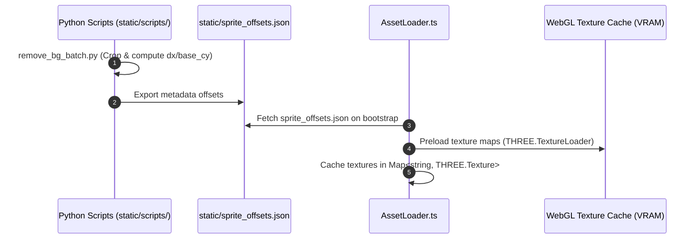

# Asset Pipeline, Spritesheet Metadata, & VRAM Lifecycle

## 1. Asset Pipeline Overview

The asset pipeline in ALINV-3D manages texture loading, sprite sheet frame extraction, bounding box offset calculation, and GPU VRAM lifecycle management.



---

## 2. Spritesheet Metadata Contract (`sprite_offsets.json`)

Billboard alignment relies on [`static/sprite_offsets.json`](file:///home/berkans/development/alienv2/static/sprite_offsets.json). Every building damage frame defines an offset object:

```json
{
  "building_1_stage_0": {
    "w": 160,
    "h": 220,
    "dx": -80,
    "dy": -220,
    "base_cy": 218,
    "x_min": 12,
    "x_max": 148,
    "y_min": 5,
    "y_max": 218
  }
}
```

### Metadata Contracts Definitions
- `w`, `h`: Tight cropped pixel dimensions of the non-transparent building sprite.
- `dx`: Horizontal pixel offset from local origin to left edge (typically $-w / 2$).
- `dy`: Vertical pixel offset from local origin to top edge.
- `base_cy`: Vertical pixel coordinate of the ground-contact line (bottom baseline).
- `x_min`, `x_max`, `y_min`, `y_max`: Tight non-transparent pixel boundary box.

---

## 3. Python Asset Processing Tools (`static/scripts/`)

The `static/scripts/` directory contains automated Python utility scripts for asset generation:

### 1. Centroid-Based Spritesheet Slicing (`partition_fire_perfect.py`)
Slices linear explosion and fire spritesheets into uniform frame grids while calculating visual center-of-mass centroids via `scipy.ndimage.center_of_mass`.

### 2. Batch Background Removal & Offsets Generator (`remove_bg_batch.py`)
Processes raw 2D artwork:
1. Strips background keying colors.
2. Crops image to tight non-transparent bounds.
3. Computes `base_cy` ground contact coordinates.
4. Generates updated JSON entries directly into `sprite_offsets.json`.

---

## 4. WebGL VRAM & Memory Leak Prevention

To prevent GPU VRAM inflation and memory leaks in browser sessions:

1. **Bootstrap Preloading**: Textures are loaded **once** during startup ([`AssetLoader.loadAll()`](file:///home/berkans/development/alienv2/src/assets/AssetLoader.ts)) and stored in a central lookup `Map<string, THREE.Texture>`.
2. **Texture Reuse**: Entities sharing building types reuse existing `THREE.Texture` references without duplicating GPU texture buffers.
3. **Disposal Protocol**: When building or particle entities are destroyed, `BuildingRenderer.cleanupDestroyedEntities()` disposes of geometry and materials while preserving shared texture assets.

---
*Back to [Documentation Sitemap](file:///home/berkans/development/alienv2/docs/README.md)*
