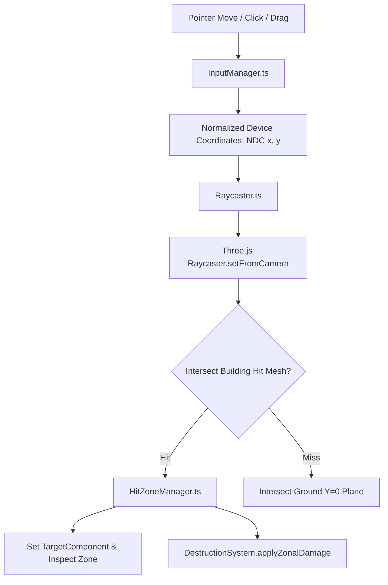

# Input Routing, 3D Raycasting, & HUD Overlays

## 1. Input Routing Pipeline (`InputManager.ts`)

Input handling ([`src/input/InputManager.ts`](file:///home/berkans/development/alienv2/src/input/InputManager.ts)) decouples DOM events from game logic systems:



---

## 2. 3D Hit Zone Raycasting & Precision Disambiguation (`HitZoneManager.ts`)

To allow precise targeting of individual building sections (Roof, Facade, Base) in a dense metropolis:

1. **Invisible Hit Meshes**: Every building entity generates invisible 3D bounding box volumes mapped to its zonal definitions ([`HitZoneManager.ts`](file:///home/berkans/development/alienv2/src/rendering/HitZoneManager.ts)).
2. **UV Coordinate Extraction**: Raycast hits return exact intersection UV coordinates $(u, v)$ on the target hit box:
   ```typescript
   if (v >= 0.70) zone = 'roof';
   else if (v >= 0.30) zone = 'facade';
   else zone = 'base';
   ```

### Small-Building Priority & Foreground Hit Disambiguation
In a dense city where small brownstones and 1x1 retail shops sit directly in front of or beside massive 150-unit skyscrapers, standard raycasting causes the massive tower's bounding volume to swallow player clicks intended for small neighboring structures.

ALINV-3D resolves this via **Weighted Screen-Space Candidate Scoring**:

```typescript
// HitZoneManager.ts multi-hit disambiguation
let distSq = dx * dx + dy * dy; // Distance from cursor to building centroid in NDC

if (bHeight <= SMALL_BUILDING_MAX_HEIGHT || bWidth <= SMALL_BUILDING_MAX_WIDTH) {
  distSq *= SMALL_BUILDING_PRIORITY_WEIGHT; // 0.36 multiplier: strongly favors small shops/houses
} else if (bHeight >= MEGA_BUILDING_MIN_HEIGHT) {
  distSq *= MEGA_LANDMARK_PENALTY_WEIGHT;   // 1.30 multiplier: large towers won't steal edge clicks
}

const score = distSq + (uvDx * uvDx + uvDy * uvDy) * 0.002; // Small bonus for center-zone hits
```

Additionally, if a raycast misses all invisible collision planes (e.g. clicking slightly off-center), `PlayerControlSystem.findBestBuildingNearCursor` queries `SpatialGrid.queryRadius(searchX, searchZ, 64)` and projects candidate centroids to NDC, applying the same small-building priority boost ($0.60\times$ distance).

---

## 3. Dynamic Target Inspector & HUD (`UIOverlay.ts`)

The HUD overlay ([`src/rendering/UIOverlay.ts`](file:///home/berkans/development/alienv2/src/rendering/UIOverlay.ts)) projects 2D HTML UI elements directly over 3D world coordinates:

```
                          ┌───────────────────────────┐
                          │ TARGET: HOSPITAL CIVIC    │
                          │ Structural Integrity: 72% │
                          │ ─── ROOF   [ 100% ]       │
                          │ ─── FACADE [  60% ]       │
                          │ ─── BASE   [   0% ]       │
                          └─────────────▲─────────────┘
                                        │
                                Screen Projection
                                        │
                                Building Mesh (World X, Y, Z)
```

- **World-to-Screen Projection**:
```typescript
const vector = buildingWorldPos.clone().project(camera);
const screenX = (vector.x * 0.5 + 0.5) * window.innerWidth;
const screenY = (-(vector.y * 0.5) + 0.5) * window.innerHeight;
```

---

## 4. UFO Flight Controls & Accessibility

### WASD & Arrow Key Isometric Navigation
In addition to mouse-tracking flight, players can steer the UFO using keyboard directional inputs. Because the camera is rotated $45^\circ$ (isometric yaw), screen directions are mapped to diagonal world vectors:

```typescript
// PlayerControlSystem.ts isometric vector mapping
if (InputManager.isKeyDown('KeyW') || InputManager.isKeyDown('ArrowUp')) {
  dirX -= 1; dirZ -= 1; // Screen UP
}
if (InputManager.isKeyDown('KeyS') || InputManager.isKeyDown('ArrowDown')) {
  dirX += 1; dirZ += 1; // Screen DOWN
}
if (InputManager.isKeyDown('KeyA') || InputManager.isKeyDown('ArrowLeft')) {
  dirX -= 1; dirZ += 1; // Screen LEFT
}
if (InputManager.isKeyDown('KeyD') || InputManager.isKeyDown('ArrowRight')) {
  dirX += 1; dirZ -= 1; // Screen RIGHT
}
```

- **Speed & Normalization**: Keyboard translation runs at $65\text{ units/s}$ with vector magnitude normalization.
- **Boundary Clamping**: Flight targets are clamped within $[-480, +480]$ to prevent flying off the edge of the world.
- **Exponential Lerp Follow**: The UFO follows target position via `1.0 - Math.exp(-LERP_FOLLOW_SPEED * delta)`, giving silky-smooth momentum.
- **Screen Flash Safety**: Screen flash vignettes use controlled opacity decay envelopes to comply with photo-sensitivity safety guidelines.

---
*Back to [Documentation Sitemap](file:///home/berkans/development/alienv2/docs/README.md)*
