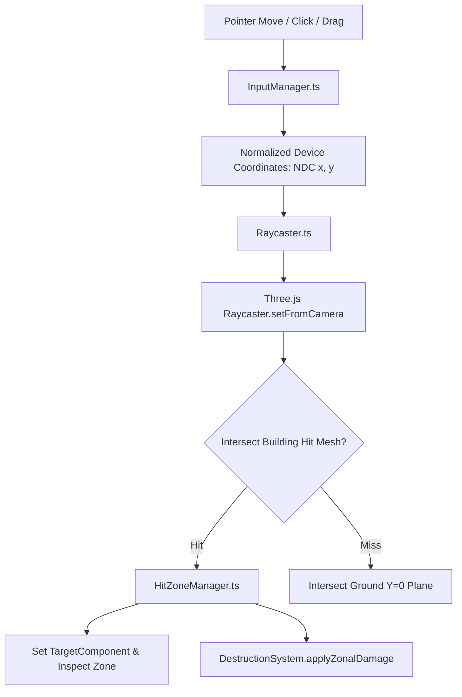

# Input Routing, 3D Raycasting, & HUD Overlays

## 1. Input Routing Pipeline (`InputManager.ts`)

Input handling ([`src/input/InputManager.ts`](file:///home/berkans/development/alienv2/src/input/InputManager.ts)) decouples DOM events from game logic systems:



---

## 2. 3D Hit Zone Raycasting (`HitZoneManager.ts`)

To allow precise targeting of individual building sections (Roof, Facade, Base):

1. **Invisible Hit Meshes**: Every building entity generates invisible 3D bounding box volumes mapped to its zonal definitions ([`HitZoneManager.ts`](file:///home/berkans/development/alienv2/src/rendering/HitZoneManager.ts)).
2. **UV Coordinate Extraction**: Raycast hits return exact intersection UV coordinates $(u, v)$ on the target hit box.
3. **Zone Mapping**:
```typescript
if (v >= 0.70) zone = 'roof';
else if (v >= 0.30) zone = 'facade';
else zone = 'base';
```

---

## 3. Dynamic Target Inspector & HUD (`UIOverlay.ts`)

The HUD overlay ([`src/rendering/UIOverlay.ts`](file:///home/berkans/development/alienv2/src/rendering/UIOverlay.ts)) projects 2D HTML UI elements directly over 3D world coordinates:

```
                          ┌───────────────────────────┐
                          │ TARGET: HOSPITAL CIVIC    │
                          │ Structural Integrity: 72% │
                          │ ─── ROOF   [ 100% ]       │
                          │ ─── FACADE [  60% ]       │
                          │ ─── BASE   [   0% ]       │
                          └─────────────▲─────────────┘
                                        │
                               Screen Projection
                                        │
                                Building Mesh (World X, Y, Z)
```

- **World-to-Screen Projection**:
```typescript
const vector = buildingWorldPos.clone().project(camera);
const screenX = (vector.x * 0.5 + 0.5) * window.innerWidth;
const screenY = (-(vector.y * 0.5) + 0.5) * window.innerHeight;
```

---

## 4. Web Accessibility & Keyboard Controls

- **Screen Flash Safety**: Screen flash vignettes use controlled opacity decay envelopes to comply with photo-sensitivity safety guidelines.
- **Keyboard Navigation**: Primary game actions support keyboard controls (`WASD` / Arrow keys for flight, `Spacebar` for laser weapon release).

---
*Back to [Documentation Sitemap](file:///home/berkans/development/alienv2/docs/README.md)*
