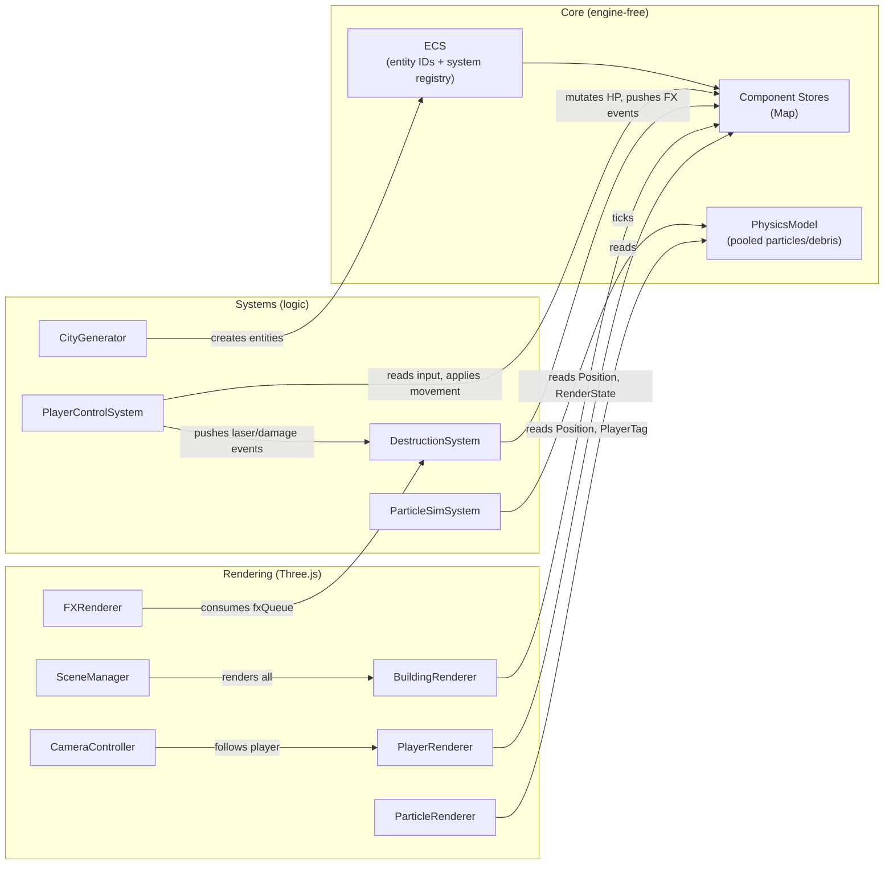
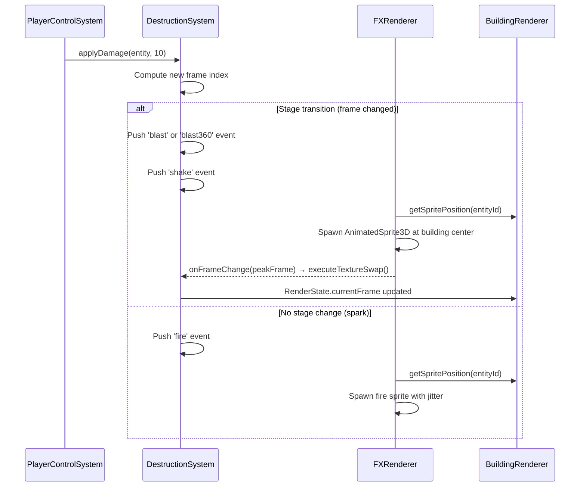
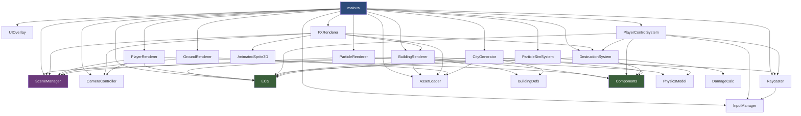

# ALINV-3D — Repository Analysis

> **2.5D isometric city-destruction game** built with Three.js, TypeScript, and Vite.  
> The player controls a UFO that hovers over a tiled city grid and fires lasers to progressively destroy buildings rendered as damage-state sprite sequences.

---

## Tech Stack

| Layer | Technology | Version |
|-------|-----------|---------|
| Language | TypeScript | ~5.6.2 |
| 3D Engine | Three.js | ^0.172.0 |
| Bundler | Vite | ^5.4.10 |
| Target | ES2020 / ESNext modules | — |

- **No frameworks** (React, Vue, etc.) — pure vanilla TS + Three.js.
- Static assets served from `static/` via Vite's `publicDir`.
- Dev server on `localhost:3000`.

---

## Project Structure

```
alinv2/
├── index.html                  # Single-page shell, mounts #app
├── style.css                   # Minimal full-bleed canvas styles
├── vite.config.ts              # publicDir: 'static', port 3000
├── tsconfig.json               # Strict mode, bundler resolution
├── package.json                # "alinv-3d" — three + vite deps only
│
├── src/                        # All source — 22 files, ~1,419 LOC
│   ├── main.ts                 # Bootstrap & game loop (89 LOC)
│   │
│   ├── core/                   # Engine-agnostic game logic
│   │   ├── ECS.ts              # Minimal Entity-Component-System (28 LOC)
│   │   ├── Components.ts       # Component interfaces + Map stores (51 LOC)
│   │   ├── BuildingDefs.ts     # Building type catalog (21 LOC)
│   │   ├── DamageCalc.ts       # HP → frame-index mapping (17 LOC)
│   │   └── PhysicsModel.ts     # Pooled particle/debris simulation (101 LOC)
│   │
│   ├── systems/                # ECS systems (logic layer, no rendering)
│   │   ├── CityGenerator.ts    # Procedural building placement (79 LOC)
│   │   ├── DestructionSystem.ts# Damage application + FX event queue (80 LOC)
│   │   ├── PlayerControlSystem.ts # Movement, aiming, firing (80 LOC)
│   │   └── ParticleSimSystem.ts# Ticks the PhysicsModel pool (23 LOC)
│   │
│   ├── rendering/              # Three.js rendering layer
│   │   ├── SceneManager.ts     # Scene, camera, renderer, render groups (92 LOC)
│   │   ├── BuildingRenderer.ts # ECS → building sprite meshes (135 LOC)
│   │   ├── PlayerRenderer.ts   # UFO mesh + camera follow (44 LOC)
│   │   ├── GroundRenderer.ts   # Tiled ground plane (37 LOC)
│   │   ├── FXRenderer.ts       # Explosion/fire/laser VFX (131 LOC)
│   │   ├── AnimatedSprite3D.ts # Frame-by-frame sprite animator (75 LOC)
│   │   ├── ParticleRenderer.ts # InstancedMesh for particles/debris (65 LOC)
│   │   ├── CameraController.ts # Follow + screen-shake (64 LOC)
│   │   └── UIOverlay.ts        # HTML HUD ("DESTRUCTION: X%") (28 LOC)
│   │
│   ├── input/                  # Pure-DOM input abstraction
│   │   ├── InputManager.ts     # Keyboard + pointer state (50 LOC)
│   │   └── Raycaster.ts        # 3D mouse-pick → Entity (49 LOC)
│   │
│   └── assets/                 # Asset pipeline
│       └── AssetLoader.ts      # Texture loader + sprite offset data (100 LOC)
│
└── static/                     # Public assets served at /
    ├── map_data.json            # 9-entry building layout (ratioX/Y per tile)
    ├── sprite_offsets.json      # Per-frame bounding box + anchor data
    ├── school/                  # 15 PNGs (frame_00 → frame_14)
    ├── hospital/               # 20 PNGs (frame_0  → frame_19)
    ├── blast/                   # 11 explosion frames
    ├── blast360/                # 7 explosion frames (360° variant)
    ├── fire/                    # 9 smoke/spark frames
    ├── hero.png                 # (unused — player is a 3D sphere)
    └── city_background_topdown_red.png  # Ground tile texture
```

> **102 PNG files**, **2 JSON data files**, and **~12 MB** zipped source assets.

---

## Architecture

### Design Philosophy

The codebase enforces a strict **simulation ↔ rendering decoupling**:

- **Core + Systems** operate on plain data (`Map<Entity, T>` stores). They have zero imports from Three.js.
- **Rendering** reads ECS component state each frame and synchronizes Three.js objects. It never mutates game state (except consuming the FX event queue).

The bridge between the two layers is the **FX event queue** (`DestructionSystem.fxQueue`), a simple array of `{type, x, y, z, data}` events that systems push and renderers consume.

### ECS Implementation



**Entity** = plain `number` (auto-incrementing from 1).  
**Components** = global `Map`/`Set` singletons (not per-entity classes):

| Component | Store Type | Fields |
|-----------|-----------|--------|
| `PositionComponent` | `Map<Entity, Position>` | `worldX`, `worldY` (depth), `worldZ` (altitude) |
| `HealthComponent` | `Map<Entity, Health>` | `currentHP`, `maxHP`, `state` (frame index) |
| `CollisionComponent` | `Map<Entity, Collision>` | `width`, `length`, `height`, `active` |
| `RenderStateComponent` | `Map<Entity, RenderState>` | `meshId`, `texturePrefix`, `currentFrame`, `visible`, `opacity` |
| `WeaponComponent` | `Map<Entity, Weapon>` | `currentSelected`, `heatLevel`, `fireRate` |
| `PlayerTagComponent` | `Set<Entity>` | *(tag only)* |
| `TargetComponent` | `Map<Entity, Target>` | `isHighValue` |

### Coordinate System

The game uses a **hybrid coordinate system** where ECS stores 2D isometric semantics but Three.js renders in 3D:

| ECS Field | Three.js Axis | Meaning |
|-----------|--------------|---------|
| `worldX` | `position.x` | Horizontal (isometric left-right) |
| `worldY` | `position.z` | Depth (isometric up-down / into screen) |
| `worldZ` | `position.y` | Altitude (vertical height above ground) |

The orthographic camera sits at `(50, 50, 50)` looking at `(0, 0, 0)`, producing a standard isometric projection. Buildings are `PlaneGeometry` meshes rotated 45° around Y to face the camera.

---

## Game Loop

Defined in [main.ts](file:///home/berkan/development/game/alinv2/src/main.ts):

```
bootstrap()
  ├── InputManager.init()          # DOM listeners
  ├── SceneManager.init(container) # Three.js scene, camera, renderer, groups
  ├── AssetLoader.loadAll()        # Fetch textures + JSON data
  ├── GroundRenderer.init()        # Tiled ground plane
  ├── Systems.init()               # Register ECS tick functions
  ├── CityGenerator.generateCity() # Spawn building entities
  └── animate() loop:
        ├── ECS.tick(delta)          # All registered systems
        ├── CameraController.tick()
        ├── BuildingRenderer.tick()
        ├── PlayerRenderer.tick()
        ├── ParticleRenderer.tick()
        ├── FXRenderer.tick()        # Consumes fxQueue
        └── SceneManager.render()
```

---

## Rendering Layer Details

### Scene Group Hierarchy

[SceneManager.ts](file:///home/berkan/development/game/alinv2/src/rendering/SceneManager.ts) organizes the scene into ordered render groups:

| Group | `renderOrder` | Contents |
|-------|:---:|---------|
| `groundGroup` | 0 | Tiled ground plane |
| `cityGroup` | 1 | Building sprite meshes |
| `playerGroup` | 2 | UFO mesh |
| `effectsGroup` | 3 | Explosions, fire, lasers, particles, debris |

> [!IMPORTANT]
> Three.js `renderOrder` on `Group` does **not** automatically propagate to children. The current approach works because all objects within a group default to `renderOrder = 0`, and the renderer uses the parent group's order for sorting. If individual child ordering is ever needed, `renderOrder` must be set per-mesh.

### Building Rendering Pipeline

[BuildingRenderer.ts](file:///home/berkan/development/game/alinv2/src/rendering/BuildingRenderer.ts) manages a `Map<Entity, THREE.Mesh>`:

1. **Mesh creation**: `PlaneGeometry(1,1)` + `MeshBasicMaterial({ transparent: true, depthWrite: false })`, rotated 45° around Y.
2. **Texture swap**: Each frame, compares `renderState.currentFrame` against the currently applied texture and hot-swaps if different.
3. **Positioning**: Uses `sprite_offsets.json` data to compute per-frame visual centroid offsets (bounding box `dx`, `dy`, `y_max`, `base_cy`) and applies them in world space with 45° cos/sin decomposition.
4. **Cleanup**: Removes meshes for destroyed entities each frame.
5. **Exposes** `getSpritePosition(entity)` for FX positioning.

### Destruction & FX Pipeline



Key detail: the texture swap happens **at the explosion's peak frame** (frame 2 for `blast`, frame 3 for `blast360`), creating a masking effect where the explosion hides the visual transition.

### FX Event Types

| Type | Trigger | Visual | Data |
|------|---------|--------|------|
| `blast` | Final destruction frame | 11-frame explosion, scale 10 | `entityId`, `targetFrame` |
| `blast360` | Intermediate stage change | 7-frame explosion, scale 10 | `entityId`, `targetFrame` |
| `fire` | Damage without stage change | 9-frame smoke/spark, scale 4, jittered | `entityId` |
| `shake` | Any stage transition | Camera offset, 0.2s | `intensity` |
| `laser` | Every shot fired | Cyan line, 80ms lifetime | `tx`, `ty`, `tz` |

### Texture & Asset Configuration

[AssetLoader.ts](file:///home/berkan/development/game/alinv2/src/assets/AssetLoader.ts) loads all textures at boot:

- **Pixelated textures** (buildings, FX): `NearestFilter`, `generateMipmaps = false`, `ClampToEdgeWrapping`
- **Non-pixelated** (ground): `LinearMipmapLinearFilter` + `LinearFilter`
- All textures stored in a `Map<string, THREE.Texture>` keyed by IDs like `building_3_stage_0`, `fx_blast_4`, etc.

### Sprite Artifact Prevention

- **White rails**: `alphaTest: 0.1` on `SpriteMaterial` in [AnimatedSprite3D.ts](file:///home/berkan/development/game/alinv2/src/rendering/AnimatedSprite3D.ts) discards near-transparent edge pixels.
- **Depth occlusion**: `depthWrite: false` on building materials prevents transparent building planes from writing to the depth buffer and occluding FX sprites behind them.

---

## Systems Layer Details

### CityGenerator

[CityGenerator.ts](file:///home/berkan/development/game/alinv2/src/systems/CityGenerator.ts) reads `map_data.json` (9 building entries with `ratioX/Y` normalized positions) and tiles them across a 15×15 grid, producing **9 × 225 = 2,025 building entities** covering a 1000×1000 world.

### PlayerControlSystem

[PlayerControlSystem.ts](file:///home/berkan/development/game/alinv2/src/systems/PlayerControlSystem.ts):

- **Movement**: WASD/Arrow keys at 40 units/sec
- **Firing (mouse)**: Raycasts to find building under cursor
- **Firing (space)**: Auto-locks nearest building by Euclidean distance
- **Cooldown**: `fireRate = 0.2s`, tracked via `heatLevel`
- **Damage**: 10 HP per hit (buildings have 100 HP max)

### Building Definitions

| Key | Name | Footprint | Frames | Sprite Path |
|-----|------|-----------|--------|-------------|
| `1` | Hospital | 2×2 | 20 (0–19) | `/hospital/frame_{i}.png` |
| `2` | Mall | 4×4 | *(not loaded)* | — |
| `3` | School | 3×2 | 15 (0–14) | `/school/{name}.png` |
| `4` | Warehouse | 4×2 | *(not loaded)* | — |

> [!NOTE]
> Only School (type 3) and Hospital (type 1) have sprite assets loaded. Mall and Warehouse are defined in `BuildingDefs` but have no textures — `map_data.json` only contains `"school"` zone entries currently.

### Physics Model

[PhysicsModel.ts](file:///home/berkan/development/game/alinv2/src/core/PhysicsModel.ts) is a pre-allocated **object pool**:
- **500 particles**: velocity-based movement, lifetime decay
- **300 debris chunks**: velocity + gravity (9.8 m/s²), floor collision at y=0

> [!NOTE]
> The particle/debris systems are initialized but currently no game code calls `spawnParticle()` or `spawnDebris()` during gameplay. `ParticleSimSystem.spawnDebrisBurst()` exists as a helper but is never invoked.

---

## Input Layer

### InputManager

[InputManager.ts](file:///home/berkan/development/game/alinv2/src/input/InputManager.ts) — stateless key/pointer tracker. Provides:
- `isKeyDown(code)` — current frame key state
- `isPointerDown()` — mouse/touch held
- `getMouseNDC()` — normalized device coordinates for raycasting

### Raycaster

[Raycaster.ts](file:///home/berkan/development/game/alinv2/src/input/Raycaster.ts) — maintains a registry of Three.js objects → Entity IDs. On query, casts a ray from the camera through the mouse NDC and walks the intersection list upward through parent objects to find a registered entity.

---

## Key Patterns & Conventions

| Pattern | Details |
|---------|---------|
| **All-static classes** | Every module is a static class with `public static` methods. No instantiation, no DI. |
| **No component removal** | Components are added but never explicitly cleaned from Maps when entities are destroyed. Renderers handle cleanup by checking `ECS.entities.has()`. |
| **Event queue bridge** | `DestructionSystem.fxQueue` is the sole communication channel from simulation → rendering. Consumed destructively via `shift()`. |
| **Shared geometry** | `BuildingRenderer` reuses a single `PlaneGeometry(1,1)` across all building meshes (scaled per-instance). |
| **Sprite offsets** | Per-frame bounding box metadata in `sprite_offsets.json` handles variable-size sprites with pixel-precise anchoring. |
| **Pixel-to-world scale** | `1 world unit = 64 pixels`. Sprite dimensions and offsets are divided by 64 to convert. |

---

## File Dependency Graph



---

## Source Code Statistics

| Module | Files | Lines |
|--------|:-----:|------:|
| `core/` | 5 | 267 |
| `systems/` | 4 | 262 |
| `rendering/` | 9 | 671 |
| `input/` | 2 | 99 |
| `assets/` | 1 | 100 |
| `main.ts` | 1 | 89 |
| **Total** | **22** | **1,419** |

Static assets: **102 PNGs**, **2 JSON** data files, **~12 MB** compressed.
