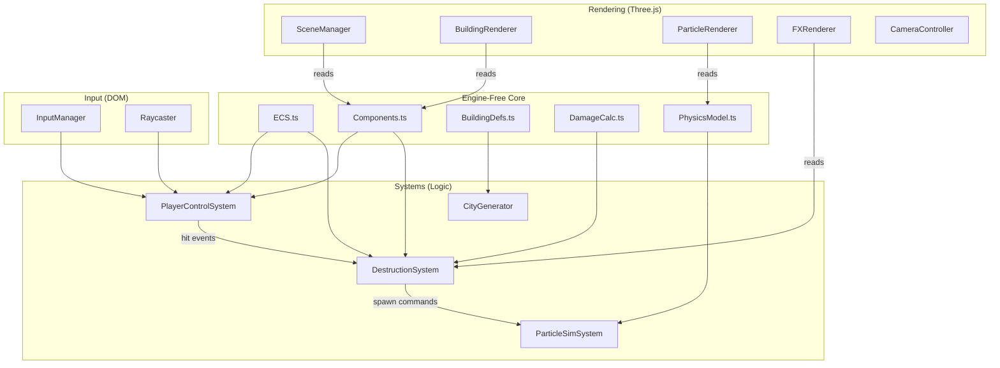

# Migration Blueprint: 2D PixiJS → 2.5D Three.js

> Complete architectural analysis of the `alinv` repository with translation directives for a clean Three.js rewrite.

---

## 1. ENGINE-AGNOSTIC DATA STATE MATRIX

This section extracts all pure data structures that carry **zero** PixiJS dependency and can be lifted verbatim into the new repo.

### 1.1 Entity System — [ECS.ts](file:///home/berkan/development/game/alinv/src/ECS.ts)

The ECS kernel is already engine-agnostic. It is a static class with:

| Member | Type | Purpose |
|---|---|---|
| `nextEntityId` | `number` | Auto-incrementing ID generator |
| `entities` | `Set<Entity>` | Live entity registry |
| `systems` | `((delta: number) => void)[]` | Ordered system tick list |

`Entity` is a plain `number` alias. `createEntity()`, `destroyEntity()`, and `tick()` have no rendering calls. **Portable as-is.**

### 1.2 Component Interfaces — [Components.ts](file:///home/berkan/development/game/alinv/src/Components.ts)

| Interface | Fields | PixiJS Coupling |
|---|---|---|
| `Position` | `worldX`, `worldY`, `worldZ` | **None** — pure world coords |
| `Health` | `currentHP`, `maxHP`, `state` (0–14 index) | **None** |
| `Collision` | `width`, `length`, `height`, `active` | **None** |
| `Target` | `isHighValue` | **None** |
| `Weapon` | `currentSelected`, `heatLevel`, `fireRate` | **None** |
| `PlayerTag` | (empty marker) | **None** |
| `Render` | `sprite: PIXI.Container`, `anchorX/Y`, `texturePrefix` | **Fully coupled** — must be rewritten |

> [!IMPORTANT]
> The `Render` component is the **only** component interface coupled to PixiJS. All six other interfaces are portable verbatim. The component data stores (`Map<Entity, T>`) are also engine-free.

### 1.3 Building Definitions — [main.ts:43-55](file:///home/berkan/development/game/alinv/src/main.ts#L43-L55)

```typescript
interface BuildingDef {
  width: number;   // tile footprint X
  length: number;  // tile footprint Y
  height: number;  // collision height (altitude units)
  name: string;
}

const BUILDING_DEFS: Record<string, BuildingDef> = {
  '1': { width: 2, length: 2, height: 2, name: 'Hospital' },
  '2': { width: 4, length: 4, height: 1, name: 'Mall' },
  '3': { width: 3, length: 2, height: 1, name: 'School' },
  '4': { width: 4, length: 2, height: 1, name: 'Warehouse' }
};
```

**Portable as-is.** No rendering dependency.

### 1.4 Map Tile Data — [map_data.json](file:///home/berkan/development/game/alinv/src/assets/map_data.json)

```typescript
interface CityTileData {
  ratioX: number;  // 0..1 position within a 15×15 chunk
  ratioY: number;
  zone: string;    // "school" | "hospital"
  size: string;    // "3x2" etc.
}
```

9 entries defining building placements via normalized ratios. **Portable as-is.**

### 1.5 Particle Data Model — [ParticleSystem.ts:4-22](file:///home/berkan/development/game/alinv/src/Systems/ParticleSystem.ts#L4-L22)

| Interface | Engine-Free Fields | Coupled Field |
|---|---|---|
| `Particle` | `x`, `y`, `vx`, `vy`, `life`, `maxLife`, `active` | `sprite: PIXI.Graphics` |
| `DebrisChunk` | `x`, `y`, `vx`, `vy`, `gravity` | `graphics: PIXI.Graphics` |

The physics simulation (velocity integration, gravity, lifetime decay) is engine-free. Only the visual representation objects need replacement.

### 1.6 Destruction Math: HP → Frame Index

From [DestructionSystem.ts:83-88](file:///home/berkan/development/game/alinv/src/Systems/DestructionSystem.ts#L83-L88):

```
damagePercent = 1 - (currentHP / maxHP)
frameIndex   = floor(damagePercent × maxFrame)
clamped to [0, maxFrame]
```

Where `maxFrame` is dynamically discovered by probing `Assets.textures[prefix + N]` until undefined. For school buildings: `maxFrame = 14` (15 frames: 0–14). For hospital: `maxFrame = 9` (10 frames per orientation).

**This is pure arithmetic. Portable as-is.**

### 1.7 Fire Instance Data — [DestructionSystem.ts:28-33](file:///home/berkan/development/game/alinv/src/Systems/DestructionSystem.ts#L28-L33)

```typescript
interface ActiveFire {
  sprite: PIXI.AnimatedSprite;  // COUPLED
  lifetime: number;             // engine-free
  maxLifetime: number;          // engine-free
}
```

---

## 2. INPUT & INTERACTION ROUTING

### 2.1 Raw Input Capture — [Input.ts](file:///home/berkan/development/game/alinv/src/Input.ts)

| Signal | Source | Storage |
|---|---|---|
| Keyboard | `window.keydown/keyup` | `Input.keys[e.code]: boolean` |
| Mouse Position | `PIXI stage.pointermove` | `Input.mouseX/Y` (world-space via `getLocalPosition(worldContainer)`) |
| Mouse Button | `PIXI stage.pointerdown/up` | `Input.mouseDown: boolean` |

> [!NOTE]
> The keyboard handling is pure DOM — portable. The mouse handling depends on PixiJS's `getLocalPosition()` to convert screen→world. In Three.js this becomes a `Raycaster` against a ground plane or `THREE.Vector2` NDC coordinates.

### 2.2 Targeting / Hit Detection — [PlayerControlSystem.ts:98-139](file:///home/berkan/development/game/alinv/src/Systems/PlayerControlSystem.ts#L98-L139)

The current system performs **inverse isometric projection** to convert screen mouse coords to world tile coords:

```
rayA = mouseX / (cos(π/4) × TILE_WIDTH)
rayB = mouseY / (sin(π/4) × 0.5 × TILE_WIDTH)

targetWorldX = (rayA + rayB) / 2
targetWorldY = (rayB - rayA) / 2
```

Then for each entity with `CollisionComponent { width, length, height }`, it solves for a Z value in `[0, height]` where the isometric ray intersects the 3D AABB:

```
zMinX = pos.worldX - 0.5 - padding - targetWorldX
zMaxX = pos.worldX + w - 0.5 + padding - targetWorldX
zMinY = pos.worldY - 0.5 - padding - targetWorldY
zMaxY = pos.worldY + l - 0.5 + padding - targetWorldY

minZ = max(0, zMinX, zMinY)
maxZ = min(h, zMaxX, zMaxY)
isHit = (minZ <= maxZ)
```

### 2.3 Three.js Translation — Input Simplification

In a 3D world this entire inverse-projection math disappears:

| Current (2D Iso) | New (Three.js 3D) |
|---|---|
| Custom inverse-iso formula | `THREE.Raycaster.setFromCamera(ndc, camera)` |
| Manual AABB Z-sweep | `raycaster.intersectObjects(buildingMeshes)` |
| Screen→world coordinate math | Native NDC → world ray automatically |
| `getLocalPosition(worldContainer)` | `(event.clientX / w) * 2 - 1` for NDC |

The hit result gives you `intersection.point` in world `(X, Y, Z)` directly — no manual inversion needed.

### 2.4 Isometric Projection Formulas — [Engine.ts:61-68](file:///home/berkan/development/game/alinv/src/Engine.ts#L61-L68)

```typescript
toScreenX(wX, wY) = (wX - wY) × cos(π/4) × TILE_WIDTH
toScreenY(wX, wY) = (wX + wY) × sin(π/4) × 0.5 × TILE_WIDTH
```

This is a 45° rotation + 0.5 vertical squash isometric projection. In Three.js:
- Buildings are placed directly at world `(X, 0, Z)` coordinates
- Camera is an `OrthographicCamera` or `PerspectiveCamera` angled to produce the 2.5D look
- **All projection math is handled by the camera matrix — these functions are eliminated entirely**

---

## 3. FX, TIMING, & EVENT TIMELINES

### 3.1 The Blast Mask Sequence — [executeDestructionStrike()](file:///home/berkan/development/game/alinv/src/Systems/DestructionSystem.ts#L69-L167)

Complete lifecycle trace:

```
FRAME 0: executeDestructionStrike() called
  ├─ Compute oldFrameIndex from health.state
  ├─ Deduct HP: health.currentHP -= damageAmount
  ├─ Compute newFrameIndex = floor((1 - HP/maxHP) × maxFrame)
  ├─ If oldFrame == newFrame → spawn minor spark, EXIT
  │
  ├─ Select explosion type:
  │   ├─ isFinalState (newFrame == maxFrame) → blast frames (11 frames), peakFrame = 2
  │   └─ else → blast360 frames (7 frames), peakFrame = 3
  │
  ├─ Create PIXI.AnimatedSprite at impact coords
  │   ├─ anchor(0.5, 0.5), scale(0.75)
  │   ├─ animationSpeed = 0.25 (~15fps at 60hz ticker)
  │   └─ loop = false
  │
  └─ .play() → animation begins
  
FRAME 2 (blast) or FRAME 3 (blast360): ← PEAK OPACITY / TEXTURE SWAP POINT
  onFrameChange fires when currentFrame == peakFrame:
  ├─ health.state = newFrameIndex
  ├─ Swap building sprite texture to prefix + newFrameIndex
  ├─ Copy defaultAnchor from new texture
  ├─ Apply frameOffsets pivot (currently all zeros)
  ├─ If newFrame >= maxFrame-2 → disable collision, remove TargetComponent
  ├─ Engine.triggerShake(intensity=8, duration=10)
  ├─ ParticleSystem.spawnDebrisBurst() → 5-8 chunks
  └─ If newFrame == maxFrame (rubble):
      └─ Spawn 1-2 fires with random offsets and 3-7s duration

FINAL FRAME: onComplete → animSprite.destroy()
```

> [!IMPORTANT]
> **The texture swap occurs at animation frame index 2 (full blast) or 3 (minor blast360), NOT at peak visual opacity.** The swap is synchronized to the explosion reaching its maximum coverage frame so the texture change is masked behind the fireball.

### 3.2 Ambient Fire Lifecycle — [spawnFire()](file:///home/berkan/development/game/alinv/src/Systems/DestructionSystem.ts#L35-L66)

```
spawnFire(x, y, duration, scale):
  1. Ignition flash: blast360 AnimatedSprite
     ├─ anchor(0.5, 0.5), scale = fireScale × 1.3
     ├─ y offset = -10 (slightly above base)
     ├─ animationSpeed = 0.35 (fast)
     ├─ loop = false → onComplete: destroy
     
  2. Persistent fire: PIXI.AnimatedSprite(fireFrames)
     ├─ anchor(0.5, 1.0) — bottom-centered
     ├─ animationSpeed = 0.15 + random(0.1)  ← DESYNCHRONIZATION
     ├─ loop = true
     └─ Pushed to activeFires[] with { lifetime: 0, maxLifetime: duration }
```

### 3.3 Continuous Fire Spawning — [DestructionSystem main loop](file:///home/berkan/development/game/alinv/src/Systems/DestructionSystem.ts#L200-L234)

For every entity with `frameIndex > 0` (any damage):
- **Spawn probability per tick:** `0.00025 × delta × frameIndex` — scales linearly with damage
- Position: screen projection of building center ± random offsets proportional to footprint
- Duration: 120–300 frames (2–5 seconds at 60fps)
- Scale: 0.06–0.14

### 3.4 Continuous Smoke Emission — [DestructionSystem:189-198](file:///home/berkan/development/game/alinv/src/Systems/DestructionSystem.ts#L189-L198)

| Damage Range | Color | Probability/tick |
|---|---|---|
| `20%–80%` of maxFrame | `0xaaaaaa` (light gray) | `0.05 × delta` |
| `≥80%` of maxFrame | `0x333333` (dark) + 50% chance `0xff5500` (ember) | `0.1 × delta` |

### 3.5 Fire Fade-Out — [DestructionSystem:237-249](file:///home/berkan/development/game/alinv/src/Systems/DestructionSystem.ts#L237-L249)

```
for each activeFire:
  lifetime += delta
  if lifetime >= maxLifetime:
    alpha -= 0.05 × delta
    if alpha <= 0: destroy + remove from array
```

### 3.6 Screen Shake — [Engine.ts:19-26](file:///home/berkan/development/game/alinv/src/Engine.ts#L19-L26) + [PlayerControlSystem.ts:57-66](file:///home/berkan/development/game/alinv/src/Systems/PlayerControlSystem.ts#L57-L66)

```
triggerShake(intensity=8, duration=10)

Per tick while duration > 0:
  offsetX = (random - 0.5) × intensity
  offsetY = (random - 0.5) × intensity
  worldContainer.x += offsetX
  worldContainer.y += offsetY
  duration -= delta
```

In Three.js: apply offset to `camera.position` instead of container translation.

---

## 4. TRANSLATION ARCHITECTURE BLUEPRINT (PIXI → THREE)

### 4.1 Core Container / Scene Graph

| PixiJS Current | Three.js Target | Notes |
|---|---|---|
| `PIXI.Application` | `THREE.WebGLRenderer` + `THREE.Scene` + `THREE.Clock` | Manual render loop via `requestAnimationFrame` |
| `PIXI.Container` (worldContainer) | `THREE.Group` (worldGroup) | Holds all world objects |
| `Engine.backgroundLayer` | `THREE.Mesh` with ground `PlaneGeometry` | Flat textured ground plane |
| `Engine.cityLayer` (sortableChildren) | `THREE.Group` — no manual sorting needed | GPU Z-buffer handles depth |
| `Engine.effectsLayer` | `THREE.Group` for particles/FX | Additive blend materials |
| `Engine.playerLayer` | `THREE.Group` for player mesh | — |
| `Engine.uiLayer` | HTML/CSS overlay or `THREE.CSS2DRenderer` | Decoupled from 3D scene |

### 4.2 Sprite / Mesh Translation

| PixiJS Current | Three.js Target | Details |
|---|---|---|
| `PIXI.Sprite` with `anchor(0.5, 1.0)` | `THREE.Sprite` or `THREE.Mesh(PlaneGeometry)` | For billboarded building sprites: use `THREE.SpriteMaterial({ map: texture })`. Anchor equivalent: shift geometry by `geometry.translate(0, height/2, 0)` so origin = bottom-center |
| `PIXI.AnimatedSprite(frames[])` | Custom `AnimatedSprite3D` class | Swap `material.map` on a timer. Track `currentFrame`, fire callbacks at target frames |
| `PIXI.Graphics` (circles, rects) | `THREE.Mesh(BoxGeometry/SphereGeometry)` or `THREE.InstancedMesh` for particles | Instanced rendering for 500+ particle pool |
| `PIXI.TilingSprite` (ground texture) | `THREE.Mesh(PlaneGeometry)` with `texture.wrapS/T = RepeatWrapping` + `texture.repeat.set(N, N)` | No rotation hack needed — plane lies flat in XZ |

### 4.3 Texture & Asset Pipeline

| PixiJS Current | Three.js Target |
|---|---|
| `PIXI.Assets.load(path) → Texture` | `THREE.TextureLoader.load(path) → Texture` |
| `texture.defaultAnchor.set(x, y)` | Geometry translation: `geometry.translate(-anchorX * w, -anchorY * h, 0)` |
| Individual frame PNGs loaded into `Texture[]` | Same PNGs loaded into `THREE.Texture[]`, assigned to `SpriteMaterial.map` |
| `setOptimalAnchor()` canvas pixel scan | Same logic, but store as metadata `{ anchorX, anchorY }` — apply via geometry offset |
| `sprite.tint = 0xRRGGBB` | `material.color.setHex(0xRRGGBB)` |

### 4.4 Coordinate System

| PixiJS Current | Three.js Target |
|---|---|
| `toScreenX(wX, wY) = (wX-wY) × cos(π/4) × 64` | Place at `mesh.position.set(wX × SCALE, 0, wY × SCALE)` |
| `toScreenY(wX, wY) = (wX+wY) × sin(π/4) × 0.5 × 64` | Camera produces the isometric perspective automatically |
| `worldZ` → vertical offset `screenY - wZ × 64` | `mesh.position.y = wZ × SCALE` |
| `sprite.zIndex = wX + wY + wZ×0.1` (manual depth sort) | **Eliminated** — GPU Z-buffer depth testing |

### 4.5 Camera

| PixiJS Current | Three.js Target |
|---|---|
| Container translation for "camera follow" | `camera.position.set(playerX + offset, camHeight, playerZ + offset)` + `camera.lookAt(playerX, 0, playerZ)` |
| `worldContainer.x = screenW/2 - screenX` | `OrthographicCamera` for true iso, or `PerspectiveCamera(fov=35)` for 2.5D |
| Screen shake via container offset | `camera.position.x += shakeOffsetX; camera.position.z += shakeOffsetZ` |

### 4.6 Input / Raycasting

| PixiJS Current | Three.js Target |
|---|---|
| `stage.eventMode = 'static'` + pointer events | Standard DOM `pointermove/down/up` on `renderer.domElement` |
| `e.getLocalPosition(worldContainer)` | Compute NDC: `mouse.x = (clientX/w)*2-1; mouse.y = -(clientY/h)*2+1` |
| Custom inverse-iso ray math | `raycaster.setFromCamera(mouse, camera)` → `raycaster.intersectObjects(buildings)` |
| Manual AABB Z-sweep for tall buildings | Three.js `Raycaster` + `Mesh.geometry.boundingBox` handles this natively |

### 4.7 Particle System

| PixiJS Current | Three.js Target |
|---|---|
| 500 `PIXI.Graphics` circles (object pool) | `THREE.InstancedMesh(SphereGeometry, MeshBasicMaterial, 500)` — single draw call |
| 300 `PIXI.Graphics` rects (debris pool) | `THREE.InstancedMesh(BoxGeometry, MeshBasicMaterial, 300)` |
| Per-particle: `sprite.x/y`, `sprite.alpha`, `sprite.tint` | Per-instance: update `instanceMatrix` + `instanceColor` via `setMatrixAt()` / `setColorAt()` |
| `activeDebrisChunks[]` with dynamic `new Graphics()` | Pre-allocated instance slots or `THREE.Points` with custom `ShaderMaterial` |

### 4.8 Animated Effects

| PixiJS Current | Three.js Target |
|---|---|
| `PIXI.AnimatedSprite(textures[])` | Custom class: `{ mesh: THREE.Sprite, frames: Texture[], currentFrame, speed, onFrameChange, onComplete }` |
| `animSprite.animationSpeed = 0.25` | Accumulate `elapsed += delta; if elapsed > 1/speed: advance frame` |
| `onFrameChange(frameIndex)` callback | Replicate in custom class — critical for texture swap synchronization |
| Fire `loop = true` with random `animationSpeed` | Same — randomize speed per instance for desync |

### 4.9 Rendering Pipeline

| PixiJS Current | Three.js Target |
|---|---|
| `app.ticker.add(callback)` | `function animate() { requestAnimationFrame(animate); ... renderer.render(scene, camera); }` |
| `ticker.deltaTime` (60hz normalized) | `clock.getDelta()` (seconds) — multiply by 60 for frame-equivalent if needed |
| `sortableChildren = true` (manual Y-sort) | **Not needed** — depth buffer |
| Alpha blending via `sprite.alpha` | `material.opacity` + `material.transparent = true` |

---

## 5. TARGET ARCHITECTURE FILE TREE

```
alinv-3d/
├── index.html
├── package.json                    # vite + typescript + three
├── tsconfig.json
├── vite.config.ts
│
├── public/
│   └── assets/
│       ├── buildings/
│       │   ├── school/             # 15 damage stage PNGs (00–14)
│       │   └── hospital/           # 20 frame PNGs (10 horiz + 10 vert)
│       ├── fx/
│       │   ├── blast/              # 11 explosion frames
│       │   ├── blast360/           # 7 minor explosion frames
│       │   └── fire/               # 9 fire loop frames
│       ├── ground/
│       │   └── city_pavement.png
│       └── maps/
│           └── map_data.json
│
└── src/
    ├── main.ts                     # Bootstrap: init renderer, load, start loop
    │
    ├── core/                       # ══ ENGINE-FREE SIMULATION LAYER ══
    │   ├── ECS.ts                  # Entity/System kernel (portable as-is)
    │   ├── Components.ts           # Position, Health, Collision, Weapon, Target, PlayerTag
    │   ├── BuildingDefs.ts         # BUILDING_DEFS record + CityTileData interface
    │   ├── DamageCalc.ts           # HP→frameIndex math, maxFrame discovery
    │   └── PhysicsModel.ts         # Particle/debris velocity, gravity, lifetime math
    │
    ├── systems/                    # ══ GAME LOGIC SYSTEMS (engine-free signatures) ══
    │   ├── PlayerControlSystem.ts  # Movement, weapon cooldown, hit resolution
    │   ├── DestructionSystem.ts    # Damage application, fire spawn scheduling
    │   ├── ParticleSimSystem.ts    # Physics integration for particles/debris
    │   └── CityGenerator.ts        # Occupancy grid, chunk-based building placement
    │
    ├── rendering/                  # ══ THREE.JS RENDERING LAYER ══
    │   ├── SceneManager.ts         # THREE.Scene, Camera, Renderer, render loop
    │   ├── CameraController.ts     # Follow player, screen shake, zoom
    │   ├── BuildingRenderer.ts     # Create/update building sprites, texture swap
    │   ├── PlayerRenderer.ts       # Player mesh/sprite visual
    │   ├── GroundRenderer.ts       # Tiling ground plane
    │   ├── ParticleRenderer.ts     # InstancedMesh pools, sync from PhysicsModel
    │   ├── AnimatedSprite3D.ts     # Frame-based texture animation with callbacks
    │   ├── FXRenderer.ts           # Explosion sprites, fire sprites, laser line
    │   └── UIOverlay.ts            # HTML/CSS HUD (score, destruction %)
    │
    ├── input/                      # ══ INPUT LAYER ══
    │   ├── InputManager.ts         # Keyboard + pointer state (pure DOM)
    │   └── Raycaster.ts            # THREE.Raycaster wrapper for target picking
    │
    ├── assets/                     # ══ ASSET LOADING ══
    │   └── AssetLoader.ts          # THREE.TextureLoader, frame array construction
    │
    └── style.css
```

### Key Architectural Principles



> [!TIP]
> **The critical boundary**: Systems in `systems/` emit data commands (e.g., "swap texture to frame 7", "spawn fire at world pos X,Z"). Renderers in `rendering/` consume these commands. Systems never import `THREE`. Renderers never mutate game state.

### `package.json` Dependencies

```json
{
  "dependencies": {
    "three": "^0.172.0"
  },
  "devDependencies": {
    "@types/three": "^0.172.0",
    "typescript": "~6.0.2",
    "vite": "^8.0.12"
  }
}
```

### Rendering Component (replaces `Render`)

```typescript
// In core/Components.ts — engine-free
export interface RenderState {
  meshId: string;           // lookup key for renderer
  texturePrefix: string;    // "building_3_stage_"
  currentFrame: number;     // synced from health.state
  visible: boolean;
  opacity: number;
}

// In rendering/BuildingRenderer.ts — Three.js side
// Maintains a Map<string, THREE.Sprite> keyed by meshId
// Each tick: reads RenderState, updates material.map if frame changed
```

This ensures the simulation layer can request visual changes without importing Three.js.
